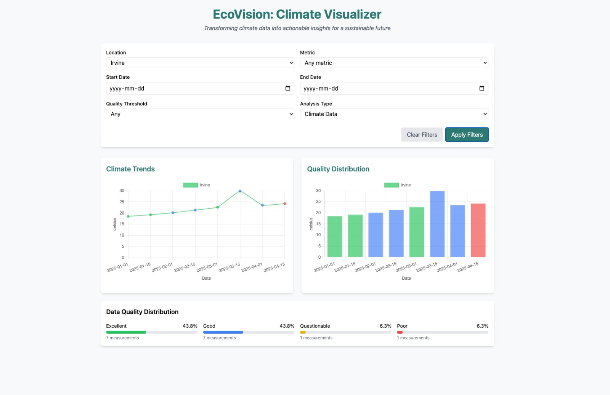
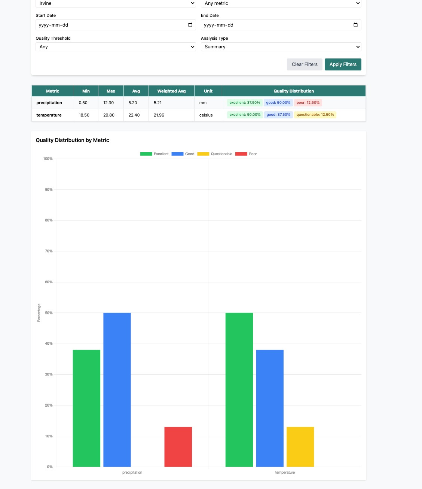
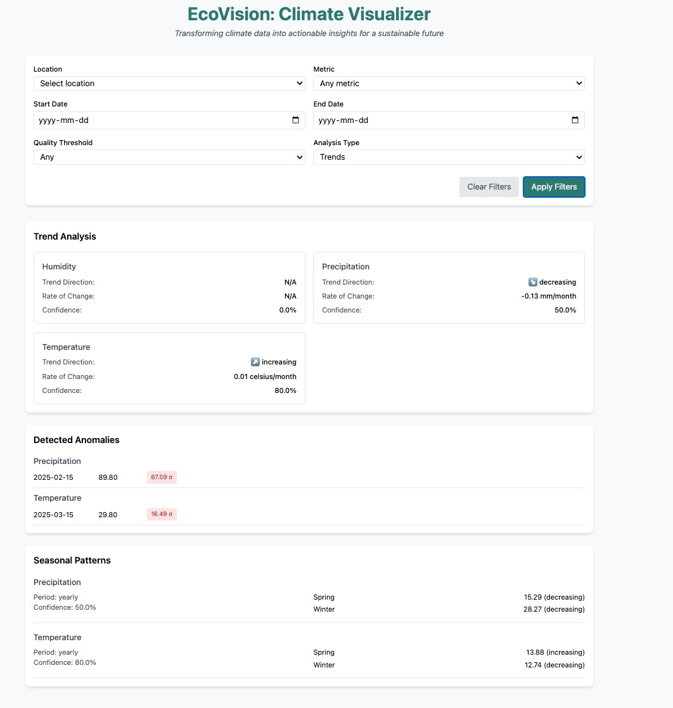
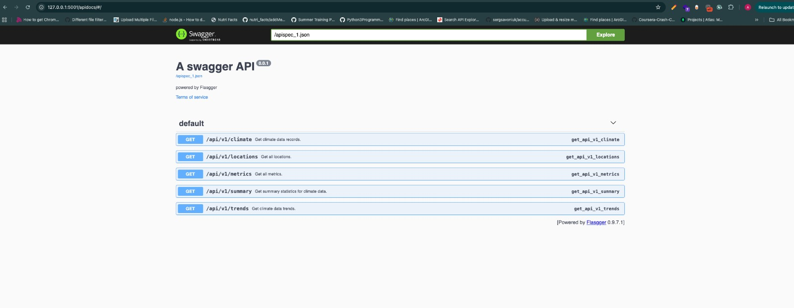
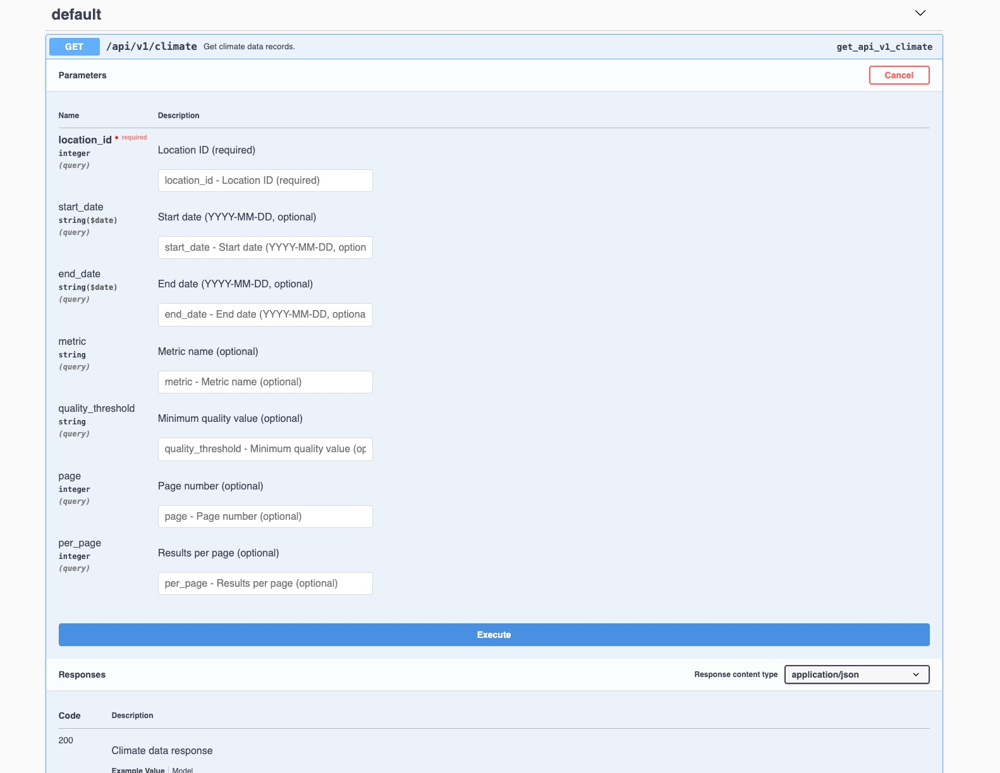

# EcoVision: Climate Visualizer — Full‑Stack Project README

A production‑ready template for exploring and visualizing climate measurements across locations and metrics. This repository contains a *Flask* backend (API + Swagger docs) and a *React/Vite/Tailwind* frontend with charts and analysis views.

---

## At a Glance

*Tech stack*

* *Frontend:* React 18, Vite, Tailwind CSS, Chart.js via react-chartjs-2
* *Backend:* Flask, MySQL (via flask-mysqldb), CORS, Swagger (flasgger), in‑memory caching (flask-caching), rate limiting (flask-limiter), structured logging
* *Testing:* pytest (backend)

*Key features*

* Browse climate *time series* with filters (location, metric, date range, quality)
* *Trend analysis* and *weighted summaries* (respecting data quality)
* Built‑in *Swagger* API docs (available at http://127.0.0.1:5001/apidocs once the server is running)
* *Versioned cache keys* for safe, explicit invalidation
* *Per‑endpoint rate limiting*
* *Rotating file logs* with 7‑day retention

*Top‑level layout*

```
backend/
  app.py              # Flask app & API endpoints
  requirements.txt    # Backend dependencies
  .env                # MySQL connection variables (sample)
  logger.py           # Timed rotating logs
  seed_db.py          # Creates tables & seeds example data
  utils/
    config.py         # Cache key versioning helpers
    validators.py     # Input validation helpers
    constants.py      # Quality values & weights
    helpers.py        # Cache maintenance & ID checks
  tests/              # pytest tests

frontend/
  src/                # React app
  vite.config.js      # Dev server + API proxy (→ 5001)
  tailwind.config.js
  package.json
```

---

## Architecture & Data Flow

1. *React (Vite dev server on :3000)* renders filters, tables, and charts.
2. API calls hit the *Vite proxy* (/api → http://127.0.0.1:5001).
3. *Flask API (on :5001)* queries MySQL, applies validation, summarization, and trend calculations.
4. Responses are *cached* (in‑memory) using *versioned keys* to ensure safe invalidation when data or algorithms change.
5. *Rate limiting* protects endpoints; *logs* are written to backend/logs/app_YYYY-MM-DD.log.

*Database (MySQL)*

* locations(id, name, ...)
* metrics(id, name, unit, description, ...)
* climate_data(id, location_id, metric_id, date, value, quality)

  * quality ∈ {excellent, good, questionable, poor}

---

## Backend

### Requirements

* Python 3.10+
* MySQL 8+ (or compatible)

### Setup

1. *Create & activate a virtual environment* (recommended):

   bash
   cd backend
   python -m venv .venv
   source .venv/bin/activate  # Windows: .venv\Scripts\activate
   
2. *Install dependencies*:

   bash
   pip install -r requirements.txt
   
3. *Configure environment* — copy .env and set MySQL variables:

   ini
   # backend/.env
   MYSQL_HOST=localhost
   MYSQL_USER=root
   MYSQL_PASSWORD=yourpassword
   MYSQL_DB=climate_data
   
4. *Run database seed* (creates tables and loads sample data):

   bash
   python seed_db.py
   
5. *Start the API*:

   bash
   export FLASK_APP=app.py
   flask run --port 5001
   

### Running tests

bash
cd backend
pytest -q


### Configuration notes

* *CORS:* enabled via flask-cors (frontend → backend during dev)
* *Swagger UI:* auto‑mounted by flasgger (visit http://127.0.0.1:5001/apidocs)
* *Logging:* TimedRotatingFileHandler writes daily logs, retains 7 days
* *Rate limiting:* configured with flask-limiter
* *Caching:* flask-caching SimpleCache (in‑memory)

### API Endpoints (v1)

Base path: /api/v1

> Common query params
>
> * location_id (int, required for most analytical endpoints)
> * metric (string; metric name)
> * start_date, end_date (YYYY-MM-DD)
> * quality_threshold (one of: excellent, good, questionable, poor)
> * page, per_page (pagination for collections)

#### 1) GET /api/v1/locations

Returns cached list of all locations.

#### 2) GET /api/v1/metrics

Returns cached list of all metrics (with units & descriptions).

#### 3) GET /api/v1/climate

Raw climate observations (filterable & pageable).

#### 4) GET /api/v1/summary

Weighted summary stats for a location/metric/date range. *Weights* come from utils/constants.py.

#### 5) GET /api/v1/trends

Returns trend data (e.g., slope, recent window aggregates) for the chosen filter set.

> *Rate limits:* Key endpoints (/summary, /trends) are protected by @limiter.limit("10 per minute").

---

## Frontend

### Requirements

* Node.js 18+

### Setup

bash
cd frontend
npm install
npm run dev


* Dev server: http://localhost:3000
* *Vite proxy* forwards /api to http://127.0.0.1:5001 (see vite.config.js). Start the backend first for live data.

### Build & preview

bash
npm run build
npm run preview


---

## Design Choices & Rationale

### 1) Caching strategy (simple, explicit, and safe)

* *Per‑endpoint caches* for reference data: @cache.cached(timeout=0, key_prefix="locations|metrics") keeps lists in memory indefinitely until explicitly cleared. These caches are *cleared automatically during data ingestion* in the seed_db.py script to ensure permanent datasets are always in sync.
* *Versioned cache keys* for computed results (summary/trends) ensure safe invalidation when data or algorithms change.
* *Manual cleanup helpers* in utils/helpers.py remove stale keys and clear forever‑cached lists before ingestion.

### 2) Rate limiting

* flask-limiter with get_remote_address and explicit per‑route limits (10 per minute) to protect expensive computations.

### 3) Logging

* TimedRotatingFileHandler writes per‑day logs to backend/logs/, rotates nightly, keeps 7 days.

### 4) Input validation & safety

* utils/validators.py validates positive ints and YYYY-MM-DD dates; also ensures end_date ≥ start_date.

### 5) Data quality & weighting

* Quality classes and weights live in utils/constants.py → transparent and testable.

### 6) Pagination

* Raw lists include meta.total_count, meta.page, meta.per_page.

### 7) Frontend build & DX

* *Vite* for instant HMR, *Tailwind* for utility‑first styling, *Chart.js* for robust chart primitives.

---

## Local Development Guide

1. *Start MySQL* and create the DB defined in .env.
2. *Run the backend* (:5001).
3. *Run the frontend* (:3000).

Open http://localhost:3000 — the app will use the Vite proxy to reach the API.

Swagger API documentation will be available at: http://127.0.0.1:5001/apidocs

---

## Future Improvements

* *Redis‑backed caching* for multi‑instance deployments.
* *Alembic migrations* to replace manual schema setup.
* *Centralized logging and monitoring* (e.g., ELK or Grafana Loki).
* *JWT‑based auth* for securing endpoints.
* *CI/CD pipeline* with automated tests and linting.
* *Improved visualization*: add heatmaps, anomaly detection, and forecast models.

---

## Screenshots

### Main App





*Browse and visualize climate data with filters and charts.*

### Swagger API Docs





